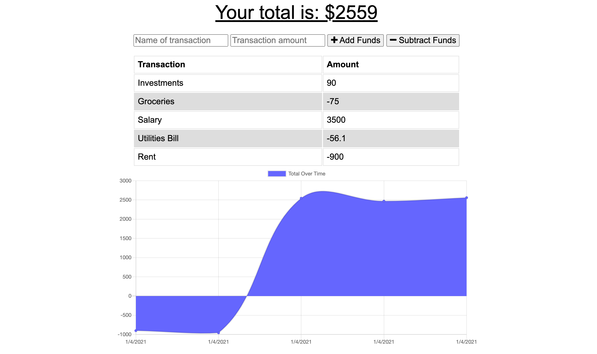

# Progressive Budget

## Description

Budget tracking application with functionality both online and offline. User is able to input deposits and expenses offline that will populate the total once back online.




## Table of Contents

1. Installation
2. Usage
3. Deployed Application
4. License
5. Contributions

## Installation

To install application dependencies enter the following in the command line:

```
npm install
```

## Usage

To run the application locally, enter the following in the command line:

```
npm run start
```

## Deployed Application

[Progressive Budget](https://smserpa.github.io/react-portfolio/#/)


## License


## Contributing

[Stefanie Serpa](https://github.com/smserpa)